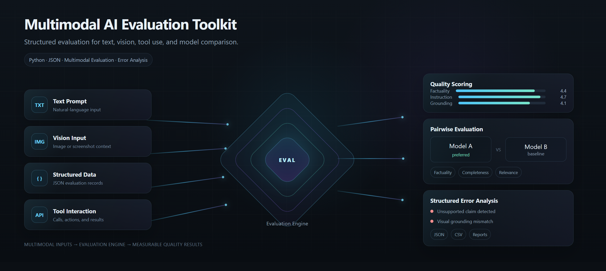
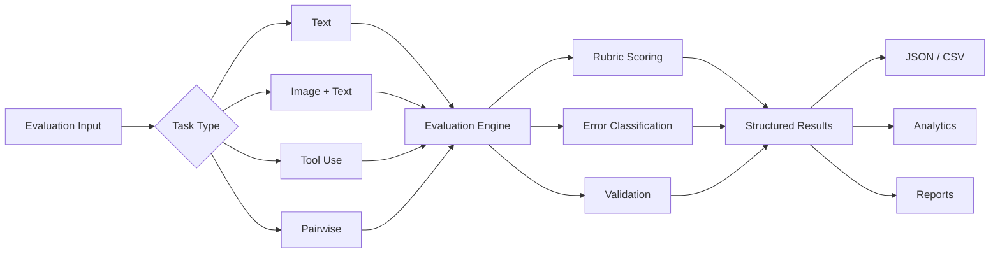

<div align="center">

# Multimodal AI Evaluation Toolkit

### Structured evaluation for LLM and multimodal AI systems

**Factuality · Instruction Following · Visual Grounding · Tool Use · Pairwise Evaluation · Error Analysis**

<br>



<br>

A Python-based evaluation toolkit for analyzing the quality, reliability, and failure patterns of **large language models and multimodal AI systems**.

The project provides structured evaluation schemas, side-by-side response comparison, multimodal assessment, error classification, scoring, and aggregate reporting.

</div>

---

## Overview

Modern AI systems need more than fluent outputs. They need to follow instructions, remain grounded in available evidence, interpret visual information correctly, use tools appropriately, and avoid unsupported claims.

The **Multimodal AI Evaluation Toolkit** provides a structured framework for evaluating those behaviors.

It is designed around practical AI evaluation workflows involving:

- LLM response evaluation
- Multimodal image and text evaluation
- Side-by-side response comparison
- AI training data quality
- Error identification and classification
- Tool-use evaluation
- Structured scoring
- Evaluation analytics

The goal is to turn subjective model review into a more **consistent, auditable, and data-driven evaluation process**.

---

## What the Toolkit Evaluates

| Dimension | Evaluation Focus |
|---|---|
| **Factuality** | Whether factual claims are accurate and supported |
| **Instruction Following** | Whether the model satisfies the user's requirements |
| **Completeness** | Whether important parts of the task are addressed |
| **Relevance** | Whether the response stays focused on the requested task |
| **Grounding** | Whether claims are supported by provided context or evidence |
| **Visual Grounding** | Whether visual information is interpreted correctly |
| **Tool Use** | Whether tools are selected and used appropriately |
| **Overall Quality** | Combined assessment of response reliability |

Evaluations use structured scoring and explicit error categories rather than relying only on a single overall rating.

---

## Core Capabilities

### Single Response Evaluation

Evaluate an individual model response against a defined rubric.

```text
Prompt
   │
   ▼
Model Response
   │
   ▼
Evaluation Rubric
   │
   ├── Factuality
   ├── Instruction Following
   ├── Completeness
   ├── Relevance
   └── Grounding
   │
   ▼
Structured Evaluation
```

---

### Multimodal Evaluation

Evaluate responses that depend on both **visual and textual information**.

Example tasks can include:

- Image question answering
- Object identification
- Chart interpretation
- Visual grounding
- Scene understanding
- Image-based instruction following
- Screenshot and interface evaluation

A multimodal evaluation record can capture both traditional response quality and visual interpretation failures.

---

### Pairwise / Side-by-Side Evaluation

Compare two model responses to the same task.

```text
                 User Prompt
                      │
             ┌────────┴────────┐
             ▼                 ▼
        Response A        Response B
             │                 │
             └────────┬────────┘
                      ▼
              Pairwise Evaluation
                      │
          ┌───────────┼───────────┐
          ▼           ▼           ▼
      Dimension    Preference   Errors
      Comparison     Strength    Found
```

The evaluator can record:

- Preferred response
- Dimension-level preference
- Preference strength
- Error types
- Evaluation justification

This supports workflows commonly used in **SxS evaluation, preference data collection, and AI quality assessment**.

---

## Error Taxonomy

The toolkit uses explicit error categories to make evaluation results easier to analyze.

```text
FACTUAL_ERROR
UNSUPPORTED_CLAIM
HALLUCINATION
INSTRUCTION_FAILURE
INCOMPLETE_RESPONSE
IRRELEVANT_CONTENT
GROUNDING_FAILURE
VISUAL_GROUNDING_ERROR
TOOL_SELECTION_ERROR
TOOL_EXECUTION_ERROR
FORMAT_VIOLATION
CONTRADICTION
```

Errors can also be assigned severity levels:

```text
LOW
MEDIUM
HIGH
CRITICAL
```

This makes it possible to analyze not only whether a response failed, but **how it failed and how serious the failure was**.

---

## Example Evaluation

```json
{
  "evaluation_id": "eval_0001",
  "task_type": "multimodal",
  "prompt": "Describe the important objects visible in the image.",
  "image": "samples/images/example_scene.jpg",
  "scores": {
    "factuality": 4,
    "instruction_following": 5,
    "completeness": 4,
    "relevance": 5,
    "visual_grounding": 3,
    "overall_quality": 4
  },
  "errors": [
    {
      "type": "VISUAL_GROUNDING_ERROR",
      "severity": "MEDIUM",
      "description": "The response identifies an object that is not visible in the image."
    }
  ],
  "verdict": "PASS_WITH_ISSUES"
}
```

The structured format makes evaluation results suitable for later processing with Python, SQL, analytics tools, or model-training pipelines.

---

## Pairwise Evaluation Example

```json
{
  "evaluation_id": "pair_0001",
  "response_a": "...",
  "response_b": "...",
  "preferred_response": "A",
  "comparison": {
    "factuality": "A",
    "instruction_following": "TIE",
    "completeness": "A",
    "relevance": "B"
  },
  "preference_strength": "MODERATE",
  "errors": {
    "response_a": [],
    "response_b": [
      "UNSUPPORTED_CLAIM"
    ]
  }
}
```

---

## Evaluation Workflow



---

## Project Structure

```text
multimodal-ai-evaluation-toolkit/
│
├── README.md
├── LICENSE
├── requirements.txt
│
├── src/
│   └── multimodal_eval/
│       ├── evaluator.py
│       ├── pairwise.py
│       ├── scoring.py
│       ├── taxonomy.py
│       ├── validators.py
│       └── reporting.py
│
├── configs/
│   ├── default_rubric.json
│   └── error_taxonomy.json
│
├── datasets/
│   └── sample_evaluations.json
│
├── samples/
│   ├── images/
│   ├── text/
│   └── tool_use/
│
├── reports/
│   └── example_report.md
│
├── docs/
│   ├── assets/
│   │   └── multimodal-evaluation-hero.png
│   ├── methodology.md
│   ├── evaluation-rubric.md
│   └── error-taxonomy.md
│
└── tests/
    ├── test_evaluator.py
    ├── test_pairwise.py
    └── test_scoring.py
```

---

## Evaluation Methodology

The evaluation framework follows four principles:

### 1. Evaluate Specific Dimensions

A response can be factually accurate while still failing to follow instructions.

Each quality dimension is therefore evaluated independently.

### 2. Identify Concrete Failures

Low scores should correspond to identifiable problems such as unsupported claims, visual grounding errors, incomplete answers, or tool-use failures.

### 3. Preserve Structured Results

Evaluation outputs use structured data formats so results can be aggregated, compared, filtered, and analyzed programmatically.

### 4. Separate Quality from Fluency

A polished response is not necessarily a reliable response.

The framework prioritizes correctness, grounding, task completion, and instruction adherence over surface-level fluency.

---

## Use Cases

The toolkit is designed for experimentation and portfolio demonstrations involving:

- LLM evaluation
- Generative AI quality assurance
- Multimodal AI evaluation
- AI training data
- Human-in-the-loop evaluation
- Side-by-side model comparison
- Model benchmarking
- Computer vision response evaluation
- Tool-use evaluation
- Dataset quality analysis
- Error analysis

---

## Technology

`Python` · `JSON` · `Structured Evaluation` · `Multimodal AI` · `Data Quality`

Additional components will be introduced as the project develops.

---

## Development Roadmap

- [ ] Core evaluation schema
- [ ] Single-response evaluator
- [ ] Error taxonomy
- [ ] Pairwise comparison module
- [ ] Multimodal evaluation examples
- [ ] Evaluation dataset
- [ ] Automated validation
- [ ] Aggregate statistics
- [ ] CSV export
- [ ] Evaluation report generation
- [ ] Unit tests

---

## Repository Goals

This project demonstrates practical work across:

**AI Evaluation**

**Multimodal AI**

**LLM Quality Assurance**

**Side-by-Side Evaluation**

**Structured Data**

**Error Analysis**

**Python Engineering**

**AI Training Data Quality**

---

## License

Released under the **MIT License**.

---

<div align="center">

### Multimodal AI Evaluation Toolkit

**Measure model quality. Identify failure patterns. Build better evaluation data.**

</div>
